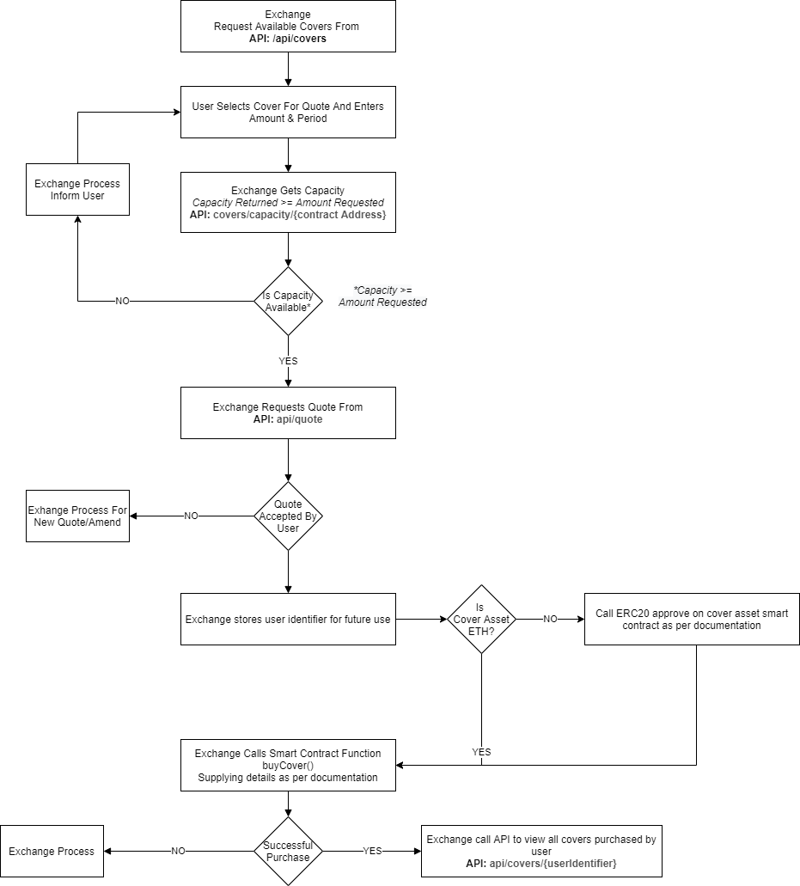

# iTrust Insure Integration 

## Registration
To register and start selling NexusMutual cover without KYC.
To register for our service please contact: **itrust**

## Workflow
Recommended workflow for integrating with iTrust Insure.

## iTrust Insure API
To enable users to `buyCover` a signed price quote is currently necessary.
### Live URL
Accesses mainnet

    API: TBC
    SWAGGER: TBC

### Test URL
Accesses kovan test network

    API: https://kovan.itrust.insure/api
    SWAGGER: https://kovan.itrust.insure/api/swagger
### Access Control
Registered exchanges will be provided with an api key.  This must be provided as a header when calling the api endpoints.
|||
|--|--|
| **HeaderKey** | x-api-key |
| **Value** | guid supplied by iTrust as part of the registration process |
|||
	
### Available Cover
Provides a list of contracts that can be covered to display within your app.
Example Call:

    curl --location --request GET '<INSERT API URL HERE>'/covers \
    --header 'x-api-key: <INSERT API KEY HERE>'

Example Response:

    [
    	{
    		"contractAddress": "0x8B3d70d628Ebd30D4A2ea82DB95bA2e906c71633",
    		"name": "bZx",
    		"type": "contract",
    		"dateAdded": "2020-01-01",
    		"logo": "https://api.nexusmutual.io/coverables/images/bzx.png",
    		"github": "https://github.com/bZxNetwork",
    		"messari": "",
    		"deprecated": false
    	},
    	{
    		"contractAddress": "0xAF350211414C5DC176421Ea05423F0cC494261fB",
    		"name": "Saturn DAO Token",
    		"type": "contract",
    		"dateAdded": "2020-01-01",
    		"logo": "https://api.nexusmutual.io/coverables/images/saturndao.png",
    		"github": "",
    		"messari": "",
    		"deprecated": false
    	}
    ]

**Important**: If an entry has `"deprecated": true` skip it. no more covers can be bought on it.

### Cover Capacity
Returns the available capacity for a particular contract in ETH. Based on available capacity you can decide whether a cover can be offered or not. (`sum assured of that cover < available capacity`).

Example Call:

    curl --location --request GET '<INSERT API URL HERE>/covers/capacity/0x519b70055af55A007110B4Ff99b0eA33071c720a' \
    --header 'x-api-key: <INSERT API KEY HERE>'

Example Response:

    {
    	"CapacityETH": "969.08499815197064084",
    	"NetStakedNXM": "12682.388440103005167",
    	"CapacityLimit": "STAKED_CAPACITY"
    }

### Quotes
Get a signed quote to use as part of the `buyCover` process
Cover period must be a minimum of 30 days and maximum 365 days.

Example Call:

    curl --location --request POST '<INSERT API URL HERE>/quote' \
    --header 'x-api-key: <INSERT API KEY HERE>' \
    --header 'Content-Type: application/json' \
    --data-raw '{
    "email": "user@domain.com",
    "coverAmount": "1",
    "currency": "ETH",
    "period": "111",
    "contractAddress": "0xAF350211414C5DC176421Ea05423F0cC494261fB"
    }'

Example Response:

    {    	
    	"id": "0db9c750-64de-4903-a9fc-f8126300f29e",
    	"currency": "ETH",   
    	"contract": "0xaf350211414c5dc176421ea05423f0cc494261fb",    
    	"period": "111",    
    	"amount": "1",    
    	"signature": "0x000000000000000000000000000000000000000000000000022559216248c765000000000000000000000000000000000000000000000000382a9bbd28b5e62100000000000000000000000000000000000000000000000000000000602e691a00000000000000000000000000000000000000000000000000000177b53cd114000000000000000000000000000000000000000000000000000000000000001cc02f0080320e21a1460bf94ce04d1a2ac0976c1f2ff2ccb20a4c2de9ecf04e2f79c43daf5f7cc49a3c0369a0303ed2455da3640c56a0b21ec3d557ab4b3da03c",    
    	"price": "185553314558255737"    
    }
**Important** returned value `id` is the user guid required for `buyCover` and getting a list of covers for a specific user.

### Covers Bought For User
Get a list of all covers bought by a specific user.  
Example Call:

    curl --location --request GET '<INSERT API URL HERE>/covers/<INSERT USERGUID HERE>' \
    --header 'x-api-key: <INSERT API KEY HERE>
**USERGUID**: returned as id from quote

Example Response:

    [
    	{
    		"coverID": "8",
    		"sumAssured": "1",
    		"coverPeriod": "111",
    		"validUntil": "2021-06-09T11:45:36+01:00",
    		"contractAddress": "0xaf350211414c5dc176421ea05423f0cc494261fb",
    		"coverAsset": "0xeeeeeeeeeeeeeeeeeeeeeeeeeeeeeeeeeeeeeeee",
    		"premiumInNXM": "4.047218451879945761",
    		"memberAddress": "0x420eee12f9bb2b1157c8c298a2b183aff3e973b7",
    		"claimID": "0",
    		"claimAsset": "0x0000000000000000000000000000000000000000",
    		"claimStatus": 0,
    		"claimPayoutAmount": "0"
    	}
    ]

## Smart Contract 
### iTrust Insure Smart Contract Network Address
### mainnet
    TBC
### kovan
    0xFfd4F1092E11a8Fd652a12c972235A42292580C1

### Buy Cover
Allows users to buy NexusMutual cover.
For the cover pricing, the contract call currently requires a quote signature provided by the itrust quote engine, 

    function  buyCover(
    	address exchangeAddress,
    	address contractAddress,
    	address coverAsset,
    	uint256 sumAssured,
    	uint16 coverPeriod,
    	uint8 coverType,
    	string memory userGUID,
    	bytes calldata coverData 
    ) external  payable nonReentrant returns (uint256)
coverData: Signature returned from quote api end point
userGUID: id returned from quote api end point
coverType: 0 (only zero supported) 

See examples below for details on implementation.

## Examples
See the following examples for integrating with our API and smart contract

### Installation & Configuration

#### Environment variables

Before running the example scripts you will need to rename the `.env.sample` to `.env` and update the values accordingly. Some values are only available from us when registering your treasury address.

	NODE_URL=YOUR_NODE_URL
	API_ENDPOINT= https://kovan.itrust.insure/api
	API_KEY=YOUR_API_KEY_SUPPLIED_BY_ITRUST
	ITRUST_CONTRACT_ADDRESS=0xFfd4F1092E11a8Fd652a12c972235A42292580C1
	TREASURY_ADDRESS=YOUR_TREASURY_ADDRESS_SUPPLIED_TO_ITRUST
	PURCHASER_PRIVATE_KEY=YOUR_TEST_ADDRESS_PRIVATE_KEY_USED_TO_PURCHASE_COVER
	QUOTE_EMAIL=YOUR_EMAIL_ADDRESS_FOR_THE_QUOTE
	QUOTE_COVER_AMOUNT=1
	QUOTE_CURRENCY=ETH
	QUOTE_PERIOD=111 // Unit in days
	QUOTE_CONTRACT_ADDRESS=THE_COVER_ADDRESS_FROM_GET_COVERS_CALL

#### Install Node and project dependencies

To install Node visit the [nodejs.org](https://nodejs.org/) website and follow the instructions. To test the installation was successful you can run the following command which will return your current node version.

	$ node -v

When you have confirmed all has installed successfully, navigate to the project root within your terminal and run the following command which will install the dependencies for the example scripts.

	$ npm install

### Running the scripts

Once you have completed the installation and configuration you will be able to run the scripts located in the [examples directory](examples).

#### Get Covers
Returns a list of covers from the API as detailed above. Located in the [examples\getCovers.js](examples/getCovers.js) script and can be run using the following command.

	$ node examples\getCovers.js

#### Get Cover Capacity
Returns the cover capacity from the API as detailed above. Located in the [examples\getCoverCapacity.js](examples/getCoverCapacity.js) script and can be run using the following command.

	$ node examples\getCoverCapacity.js

#### Get Quote
Returns a quote from the API as detailed above. Located in the [examples\getQuote.js](examples/getQuote.js) script and can be run using the following command.

	$ node examples\getQuote.js

#### Get Quote & Buy
Returns a quote from the API and proceeds to purchase with the smart contract. Located in the [examples\getQuoteAndBuy.js](examples/getQuoteAndBuy.js) script and can be run using the following command.

	$ node examples\getQuoteAndBuy.js
